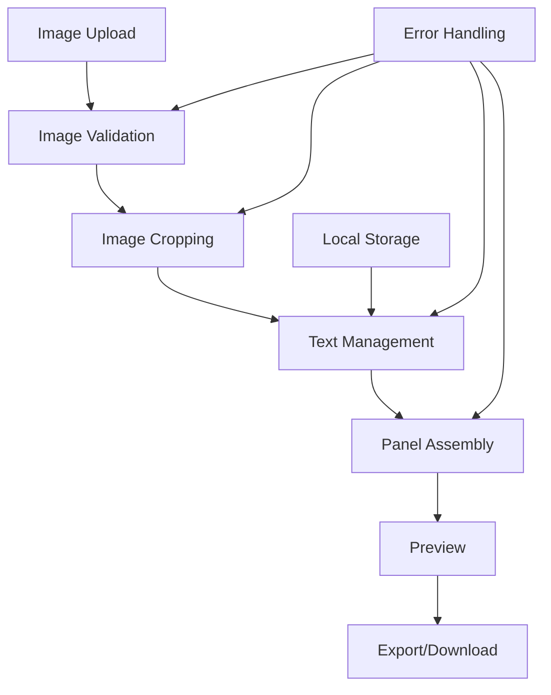

# Twitch Panels Implementation Plan

## 🎯 **Project Overview**

A SvelteKit-based Twitch panel creator with the following key features:

- **320px width** panels with **configurable height** (default 100px)
- **Multiple image upload methods**: URL, drag-and-drop, Ctrl+V paste
- **Image cropping interface** with proper constraints
- **Dynamic text management** (add, edit, delete)
- **Real-time preview** with navigation
- **Batch download** using JSZip

## 📁 **Project Structure**

```
src/
├── components/
│   ├── ImageUpload.svelte      # Drag/drop, paste, URL input
│   ├── ImageCropper.svelte     # Cropperjs integration
│   ├── TextManager.svelte      # Text CRUD operations
│   ├── PanelPreview.svelte     # Canvas preview
│   ├── PanelList.svelte        # Panel navigation
│   └── DownloadModal.svelte    # Batch download
├── lib/
│   ├── utils/
│   │   ├── imageProcessor.ts   # Image handling
│   │   ├── textManager.ts      # Text operations
│   │   ├── panelStorage.ts     # Local storage
│   │   └── batchProcessor.ts   # JSZip integration
│   ├── types/
│   │   ├── panel.ts            # TypeScript interfaces
│   │   └── errors.ts           # Error types
│   └── services/
│       ├── imageService.ts     # Image operations
│       ├── textService.ts      # Text operations
│       └── exportService.ts    # Export functionality
└── stores/
    ├── panelStore.ts           # Reactive state
    └── uiStore.ts              # UI state
```

## 📋 **Implementation Tasks**

### **Setup and Configuration**

- [ ] Install required dependencies (JSZip, cropperjs, file-saver)
- [ ] Configure TypeScript types for new features
- [ ] Set up proper error handling structure
- [ ] Configure GitHub Pages deployment settings

### **Core Image Upload System**

- [ ] Create drag-and-drop zone component
- [ ] Implement Ctrl+V paste functionality
- [ ] Add URL-based image loading
- [ ] Create image validation and error handling
- [ ] Implement image preview before cropping

### **Image Cropping Interface**

- [ ] Integrate cropperjs library
- [ ] Create responsive crop interface
- [ ] Add crop ratio constraints (320px width)
- [ ] Implement crop confirmation and cancellation
- [ ] Handle crop errors and edge cases

### **Text Management System**

- [ ] Create dynamic text list component
- [ ] Implement add/edit/delete text functionality
- [ ] Add text positioning controls
- [ ] Implement text styling options (font, size, color)
- [ ] Add text validation and error handling

### **Canvas Rendering Engine**

- [ ] Upgrade SvelteKonva implementation
- [ ] Create dynamic height support
- [ ] Implement real-time preview updates
- [ ] Add layer management system
- [ ] Optimize rendering performance

### **Panel Management**

- [ ] Create panel storage system
- [ ] Implement panel navigation (previous/next)
- [ ] Add panel deletion functionality
- [ ] Create panel export queue
- [ ] Implement panel validation

### **Batch Download System**

- [ ] Integrate JSZip library
- [ ] Create batch rendering engine
- [ ] Implement parallel image generation
- [ ] Add progress tracking
- [ ] Handle large batch downloads
- [ ] Create download error recovery

### **User Interface**

- [ ] Design responsive layout
- [ ] Create modal dialogs for crop/confirm
- [ ] Add loading states and spinners
- [ ] Implement keyboard shortcuts
- [ ] Add tooltips and help text
- [ ] Create error message system

### **Error Handling and Validation**

- [ ] Implement comprehensive error boundaries
- [ ] Add input validation for all forms
- [ ] Create user-friendly error messages
- [ ] Add retry mechanisms for failed operations
- [ ] Implement logging for debugging

### **Performance Optimization**

- [ ] Add image compression for uploads
- [ ] Implement lazy loading for panels
- [ ] Optimize canvas rendering
- [ ] Add memory management for large batches
- [ ] Create debouncing for rapid inputs

### **Testing and Quality Assurance**

- [ ] Create unit tests for core functions
- [ ] Add integration tests for user flows
- [ ] Test with various image formats and sizes
- [ ] Validate error scenarios
- [ ] Test performance with large datasets

### **Documentation and Deployment**

- [ ] Create user documentation
- [ ] Add GitHub Pages deployment script
- [ ] Configure proper build optimization
- [ ] Set up CI/CD pipeline
- [ ] Create README with setup instructions

## 🔧 **Technical Implementation Details**

### **Core Components Architecture**

#### **Image Upload System**

- **Drag & Drop**: HTML5 drag API with visual feedback
- **Paste Handler**: Clipboard API integration
- **URL Input**: Fetch API with CORS handling
- **Validation**: File size limits (max 10MB), format checking

#### **Image Cropping**

- **Library**: Cropper.js with Svelte wrapper
- **Constraints**: Fixed 320px width, variable height
- **Output**: Base64 cropped images
- **Error Handling**: Invalid crop areas, format conversion

#### **Text Management**

- **CRUD Operations**: Add, edit, delete text elements
- **Styling**: Font selection, size, color, positioning
- **Validation**: Text length limits, character encoding
- **Real-time Updates**: Live preview synchronization

#### **Canvas Rendering**

- **SvelteKonva**: Enhanced implementation
- **Dynamic Height**: Flexible panel dimensions
- **Layer Management**: Background + text layers
- **Performance**: Debounced updates, lazy rendering

#### **Batch Processing**

- **JSZip**: Parallel image generation
- **Progress Tracking**: Real-time progress updates
- **Memory Management**: Stream processing for large batches
- **Error Recovery**: Failed image retry mechanism

## 🚨 **Error Handling Strategy**

### **Common Issues to Address**

1. **Image Loading Failures**
   - CORS errors for external URLs
   - Corrupted image files
   - Network timeouts

2. **Canvas Rendering Issues**
   - Memory limits for large canvases
   - Font loading failures
   - Invalid text encoding

3. **User Input Errors**
   - Empty text fields
   - Invalid image URLs
   - Crop area too small

4. **Export Problems**
   - Large batch timeouts
   - Storage quota exceeded
   - Browser download restrictions

### **Error Recovery Patterns**

- **Retry Mechanisms**: Exponential backoff for failed operations
- **Fallback Options**: Default fonts, error images
- **User Guidance**: Clear error messages with suggested fixes
- **Graceful Degradation**: Basic functionality without advanced features

## 📱 **User Interface Considerations**

### **Responsive Design**

- **Mobile Support**: Touch-friendly controls
- **Desktop Optimization**: Keyboard shortcuts
- **Accessibility**: Screen reader compatibility

### **User Experience**

- **Loading States**: Visual feedback during operations
- **Progress Indicators**: For batch processes
- **Undo/Redo**: For text and panel operations
- **Keyboard Shortcuts**: Ctrl+V for paste, arrow keys for navigation

## 🚀 **Deployment Configuration**

### **GitHub Pages Setup**

- **Base Path**: Automatic path handling for subdirectories
- **Build Optimization**: Code splitting, lazy loading
- **Cache Strategy**: Proper cache headers for static assets

### **Performance Optimizations**

- **Image Compression**: WebP format conversion
- **Lazy Loading**: On-demand panel rendering
- **Bundle Splitting**: Separate chunks for large libraries
- **Service Worker**: Offline functionality consideration

## 📊 **Testing Strategy**

### **Test Coverage**

- **Unit Tests**: Individual component testing
- **Integration Tests**: User workflow validation
- **Performance Tests**: Large batch processing
- **Error Scenarios**: Edge case handling

### **Test Data**

- **Sample Images**: Various formats and sizes
- **Text Content**: Unicode characters, special symbols
- **Network Conditions**: Slow connections, timeouts

## 🔄 **Data Flow Architecture**



## 🎯 **Priority Implementation Order**

### **Phase 1: Core Features**

1. Image Upload System (drag/drop, paste, URL)
2. Image Cropping Interface
3. Text Management System
4. Canvas Rendering Engine
5. Basic Preview

### **Phase 2: Advanced Features**

1. Panel Management System
2. Batch Download System
3. User Interface Enhancements
4. Error Handling Improvements

### **Phase 3: Polish & Deployment**

1. Performance Optimization
2. Testing & Quality Assurance
3. Documentation & Deployment
4. CI/CD Pipeline

---

_Created: 2026-02-03_
_Last Updated: 2026-02-03_
